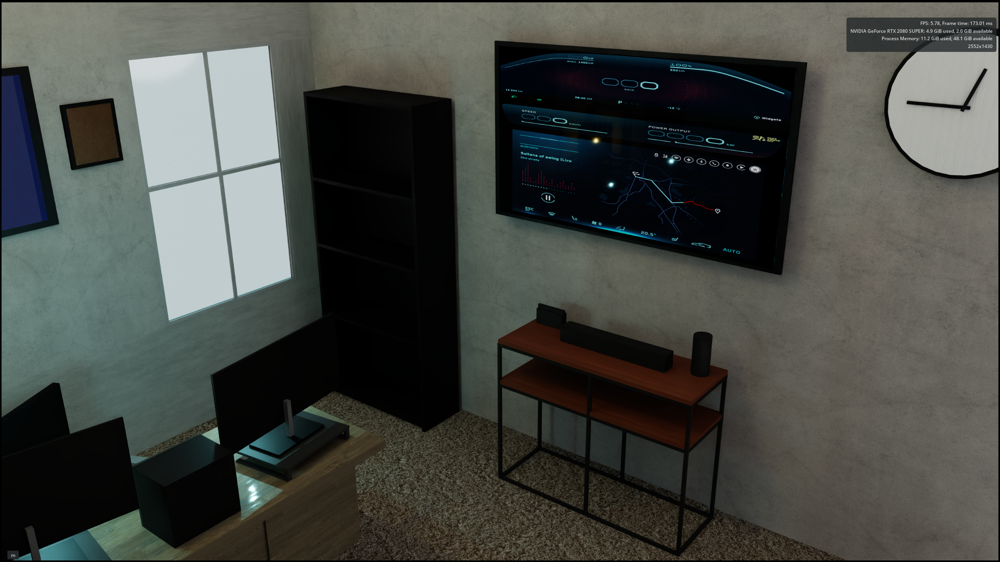

# Real-Time Digital Twin Office – Lighting & Material Study (Omniverse + OpenUSD)

---

## Project Overview

This project demonstrates the creation of a **real-time digital twin office environment** (my own) using NVIDIA Omniverse and OpenUSD, with a focus on **physically-inspired lighting, material realism, and cinematic scene composition**.

The goal was to replicate real-world lighting behavior using practical sources (lamp, monitors, and daylight) while maintaining performance within a real-time rendering pipeline.

---

## Demo
<p align="center">
  
</p>

*Real-time lighting study demonstrating practical light sources, material response, and cinematic composition in Omniverse.*
---

## Highlights

These selected renders show the final lighting study from multiple cinematic angles, emphasizing practical lamp lighting, cool daylight fill, reflective material response, and scene composition inside the reconstructed office environment.

### 1. Hero Lighting Shot
A close cinematic view of the desk lamp, showing the strongest shadow interplay, warm practical light, and reflective response on the desk surface.


### 2. Environment Composition
A wider composition that frames the desk, monitors, and lamp together to show how lighting and spatial layout work as a cohesive digital twin scene.


### 3. Full Scene Context
A broader environment shot that establishes the room layout, furniture placement, and overall balance between daylight, monitor fill, and practical lighting.



### 4. Interactive Display Integration
A scene view highlighting the wall-mounted display and secondary room elements, showing how interface-driven surfaces can be integrated into a visually grounded digital twin environment.


## Key Objectives

- Build a structured OpenUSD scene using proper hierarchy and referencing
- Develop physically plausible lighting using multiple light sources:
  - Area lighting (RectLight for window simulation)
  - Practical lighting (lamp as primary focal source)
  - Fill lighting (monitor glow simulation via SphereLight)
- Achieve cinematic composition using:
  - Contrast (warm vs cool lighting)
  - Shadow shaping
  - Reflection and material response
- Optimize scene for real-time rendering in Omniverse

---

## Technical Breakdown

### Scene Construction
- OpenUSD stage composition with modular asset organization
- Version-controlled USD stages (`v01 → v03`)
- Clean separation of:
  - `/assets`
  - `/materials`
  - `/usd`
  - `/media`

---

### Lighting Strategy

| Light Source | Purpose |
|---|---|
| RectLight (Window) | Simulated daylight entry |
| SphereLight (Monitors) | Fake emissive screen glow |
| DiscLight | Directional sunlight shaping |
| Practical Lamp | Primary cinematic focal point |

---

### Materials

- OmniPBR-based materials for:
  - Wood (desk surface)
  - Matte walls
  - Metallic lamp structure
- Reflection tuning for realism (desk surface highlights)
- Color variation for wall art to avoid flat composition

---

### Camera & Composition

- Multiple cinematic camera angles captured
- Depth and framing used to guide viewer focus
- Final hero shot emphasizes:
  - Shadow interplay
  - Warm lighting contrast
  - Surface reflections

---

## Challenges & Solutions

**Instanced Monitor Materials**
- Challenge: Unable to modify emissive materials due to instancing constraints
- Solution: Introduced SphereLight to simulate screen glow while preserving instancing integrity

**Window Lighting Realism**
- Challenge: RectLight produced hard edges and unrealistic falloff
- Solution: Combined scaled RectLight with DiscLight to simulate natural daylight gradient

**Lighting Balance**
- Challenge: Overpowering warm lamp vs flat environment lighting
- Solution: Balanced warm practical light with cool fill sources to achieve cinematic contrast

---

## Why This Matters

This project demonstrates key digital twin engineering skills:

- Scene assembly using OpenUSD
- Real-time lighting design in Omniverse
- Visual storytelling through simulation environments
- Understanding of physically-inspired rendering techniques

---

## Project Structure

```text
project_06_digital_twin_desk/
├── images/
│   ├── digital_twin_lighting_01.png
│   ├── digital_twin_lighting_02.png
│   ├── digital_twin_lighting_03.png
│   └── digital_twin_lighting_04.png
├── media/
│   ├── digital_twin_and_lighting.gif
│   └── digital_twin_and_lightning.mp4
├── usd/
│   ├── desk_twin_v01.usda
│   ├── desk_twin_v02.usda
│   └── desk_twin_v03.usda
└── README.md


---

## Next Steps

- Introduce sensor simulation (camera / LiDAR)
- Expand into synthetic data generation pipeline
- Add semantic labeling for AI training workflows

---
